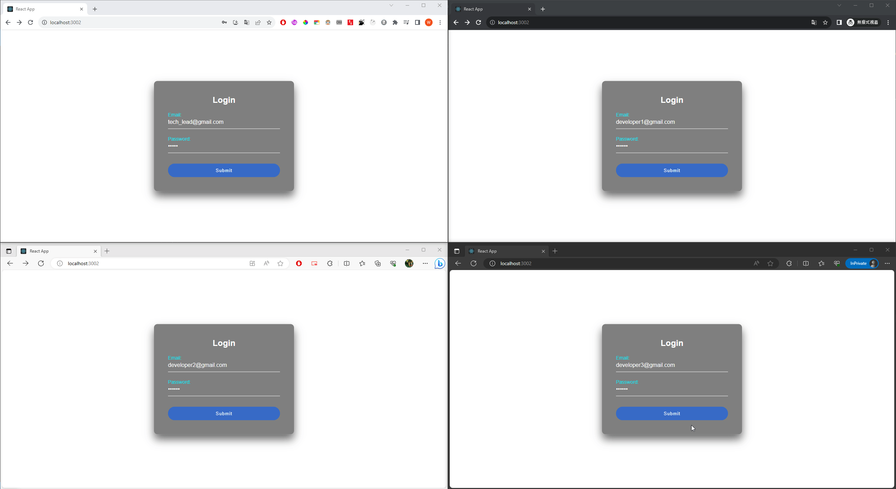

## Demo

A website for a team to vote for specific topics simultaneously.


## Used Techniques

- React (Typescript)
- Java Spring Boot
- WebSocket
- Docker
- Redis
- MySQL

## Preparation

1. Docker Container with MySQL & Redis

```
cd docker
docker-compose up --build
```

2. Frontend - React

```
cd frontend
npm install
npm run
```

3. Backend - Java Spring Boot

```
IntelliJ IDEA: File -> New -> Project From Existing Sources...
Choose the pom.xml in backend folder
Build & Run
```

## How to use

1. Login website using the following accounts:

```
Name                     Password   Name            Role
tech_lead@gmail.com      123456     Tech Lead       Tech Lead
developer1@gmail.com     123456     Developer 1     Developer
developer2@gmail.com     123456     Developer 2     Developer
developer3@gmail.com     123456     Developer 3     Developer
developer4@gmail.com     123456     Developer 4     Developer
developer5@gmail.com     123456     Developer 5     Developer
developer6@gmail.com     123456     Developer 5     Developer
```

2. Only Role with "Tech Lead" can select the Story if there is not any Active stories.
   (Optional) Login multiple accounts
3. Click one of the 3 stories to set its status to Active using "Tech Lead" account
4. All users should be redirected to point estimate page
   Then, submit all point estimate for all accounts
5. After all accounts submitted their point estimate, all users will be redirected to the result page

## Further Update

1. Change Login method to OAuthuse JWT token instead of email so backend can valid the user for every api call
2. UI
3. Add default choice for Point Estimate select tag
4. Add :hover css in Story List
5. Update error message in i18n format
6. Need to update checkIfLogin in App.tsx
7. Update WebSocket Structure
8. Add Comment in Java Spring Boot
9. Save the final point to MySQL (already created field)
